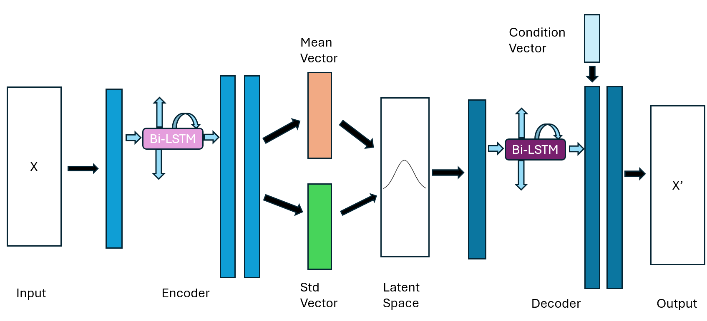
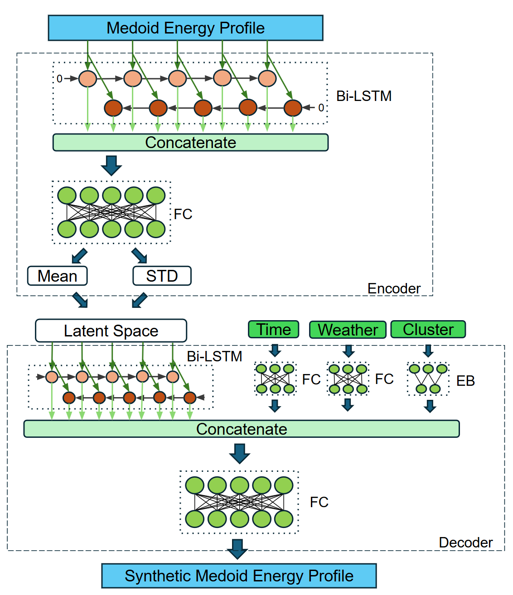
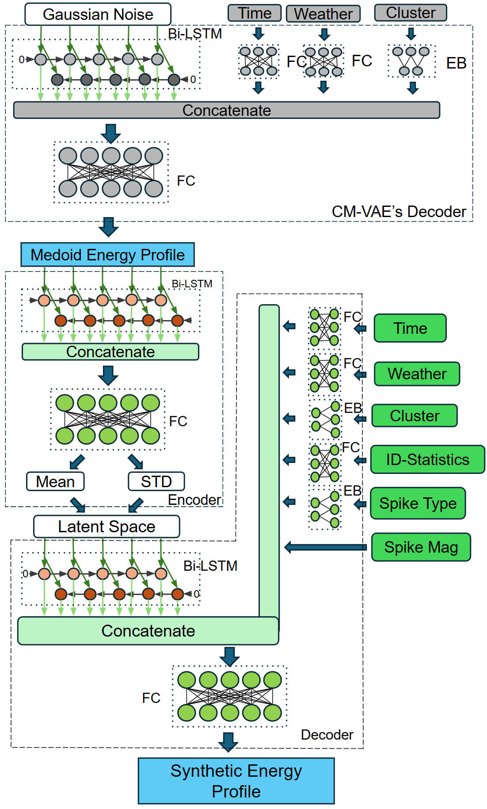

# Virtual Residential Load Profile Generation via Deep Conditional Generative Models

Reference implementation for the paper **“Virtual Residential Load Profile Generation via Deep Conditional Generative Models”**.

This repository generates realistic **half-hourly residential electricity load profiles** using a **deep conditional generative pipeline** designed to preserve:
- long-term household behavior,
- short-term variability and transient spikes,
- temporal periodicity (day/year cycles),
- weather-driven demand response.

---

## Method overview (CC-VAE-BiLSTM)

The proposed model is a **cascaded conditional VAE framework**:

1. **CM-VAE (Cluster/Medoid VAE)**  
   Learns a representative “medoid-like” profile for each behavior cluster conditioned on:
   - weather (e.g., temperature / wind speed / humidity),
   - cyclic time encoding (day-of-year + time-of-day),
   - cluster id.


2. **IC-VAE (Individual / Medoid→User VAE)**  
   Refines the medoid signal into an individual household profile conditioned on:
   - user statistics descriptor: `[mean, median, std, min, max, gradient]`,
   - spike-type sequence (categorical labels),
   - spike-magnitude modifiers,
   - weather + time + cluster.


3. **Enhancement: Periodic noise injection**  
   Adds high-frequency “texture” back into low-consumption regions using an empirically estimated period distribution.

## Environment

Recommended:
- Python 3.8+
- PyTorch (CUDA optional)

Dataset URL: [Smart Meters in London](https://www.kaggle.com/datasets/jeanmidev/smart-meters-in-london)

Example:
```bash
pip install -r requirements.txt
